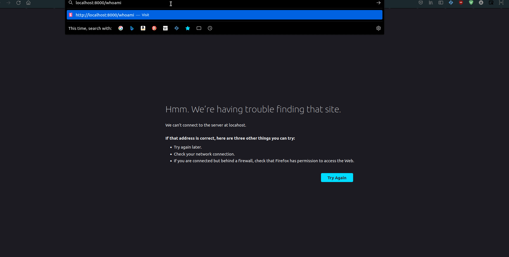
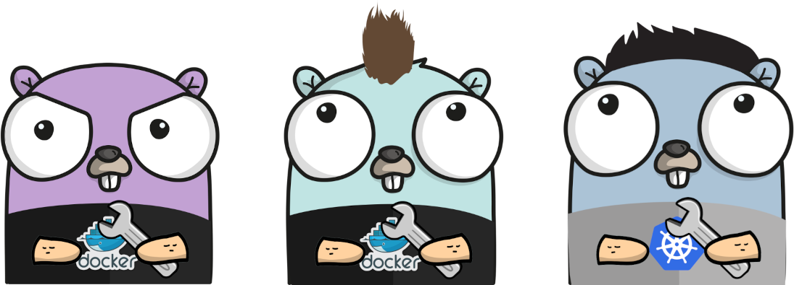

# Traefik Ondemand Plugin


Traefik middleware to start containers on demand.


## Features

- Support for **Docker** containers
- Support for **Docker swarm** mode, scale services
- Support for **Kubernetes** Deployments
- Start your container/service on the first request
- Automatic **scale to zero** after configured timeout upon last request the service received
- Dynamic loading page (cloudflare or grafana cloud style)


## Usage

### Plugin configuration

```yml
testData:
  serviceUrl: http://ondemand:10000
  name: TRAEFIK_HACKATHON_whoami
  timeout: 1m
```

| Parameter    | Type            | Example                    | Description                                                             |
| ------------ | --------------- | -------------------------- | ----------------------------------------------------------------------- |
| `serviceUrl` | `string`        | `http://ondemand:10000`    | The docker container name, or the swarm service name                    |
| `name`       | `string`        | `TRAEFIK_HACKATHON_whoami` | The container/service to be stopped (docker ps                          | docker service ls) |
| `timeout`    | `time.Duration` | `1m30s`                    | The duration after which the container/service will be scaled down to 0 |

### Traefik-Ondemand-Service

The [traefik-ondemand-service](https://github.com/acouvreur/traefik-ondemand-service) must be used to bypass [Yaegi](https://github.com/traefik/yaegi) limitations.

Yaegi is the interpreter used by Traefik to load plugin and run them at runtime.

The docker library that interacts with the docker deamon uses `unsafe` which must be specified when instanciating Yaegi. Traefik doesn't, and probably never will by default.

## Examples

- [Docker Classic](./examples/docker_classic/)
- [Docker Swarm](./examples/docker_swarm/)
- [Multiple Containers](./examples/multiple_containers/)
- [Kubernetes](./examples/kubernetes/)

## Authors

[Alexis Couvreur](https://www.linkedin.com/in/alexis-couvreur/) (left)
[Alexandre Hiltcher](https://www.linkedin.com/in/alexandre-hiltcher/) (middle)
[Matthias Schneider](https://www.linkedin.com/in/matthias-schneider-18831baa/) (right)


