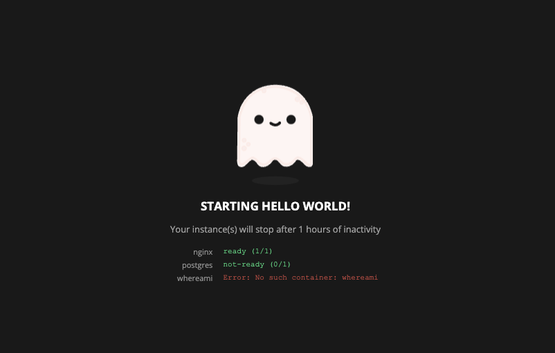

# ⏳ Sablier

   

Sablier is an API that start containers for a given duration.

It provides an integrations with multiple reverse proxies and different loading strategies.

Which allows you to start your containers on demand and shut them down automatically as soon as there's no activity.


- [⏳ Sablier](#-sablier)
  - [⚡️ Quick start](#️-quick-start)
  - [⚙️ Configuration](#️-configuration)
  - [Dynamic loading](#dynamic-loading)
    - [Dynamic Strategy Configuration](#dynamic-strategy-configuration)
    - [Custom Themes](#custom-themes)
  - [Blocking strategy](#blocking-strategy)
  - [Reverse proxies integration plugins](#reverse-proxies-integration-plugins)
    - [Traefik Integration](#traefik-integration)
      - [Traefik with Docker classic](#traefik-with-docker-classic)
      - [Traefik with Docker Swarm](#traefik-with-docker-swarm)
      - [Traefik with Kubernetes](#traefik-with-kubernetes)
    - [Caddy Integration](#caddy-integration)
  - [Credits](#credits)

## ⚡️ Quick start

```bash
# Create and stop nginx container
docker run -d --name nginx nginx
docker stop nginx

# Create and stop whoami container
docker run -d --name whoami containous/whoami:v1.5.0
docker stop whoami

# Start Sablier with the docker provider
docker run -v /var/run/docker.sock:/var/run/docker.sock -p 10000:10000 ghcr.io/acouvreur/sablier:latest --provider.name=docker

# Start the containers, the request will hang until both containers are up and running
curl 'http://localhost:10000/api/strategies/blocking?names=nginx&names=whoami&session_duration=1m'
[
  {
    "Instance": {
      "Name": "whoami",
      "CurrentReplicas": 1,
      "Status": "ready",
      "Message": ""
    },
    "Error": null
  },
  {
    "Instance": {
      "Name": "nginx",
      "CurrentReplicas": 1,
      "Status": "ready",
      "Message": ""
    },
    "Error": null
  }
]
```

## ⚙️ Configuration

| Cli                                            | Yaml file                                    | Environment variable                         | Default           | Description                                                                                                                                         |
| ---------------------------------------------- | -------------------------------------------- | -------------------------------------------- | ----------------- | --------------------------------------------------------------------------------------------------------------------------------------------------- |
| `--provider.name`                              | `provider.name`                              | `PROVIDER_NAME`                              | `docker`          | Provider to use to manage containers [docker swarm kubernetes]                                                                                      |
| `--server.base-path`                           | `server.base-path`                           | `SERVER_BASE_PATH`                           | `/`               | The base path for the API                                                                                                                           |
| `--server.port`                                | `server.port`                                | `SERVER_PORT`                                | `10000`           | The server port to use                                                                                                                              |
| `--sessions.default-duration`                  | `sessions.default-duration`                  | `SESSIONS_DEFAULT_DURATION`                  | `5m`              | The default session duration                                                                                                                        |
| `--sessions.expiration-interval`               | `sessions.expiration-interval`               | `SESSIONS_EXPIRATION_INTERVAL`               | `20s`             | The expiration checking interval. Higher duration gives less stress on CPU. If you only use sessions of 1h, setting this to 5m is a good trade-off. |
| `--storage.file`                               | `storage.file`                               | `STORAGE_FILE`                               |                   | File path to save the state                                                                                                                         |
| `--strategy.blocking.default-timeout`          | `strategy.blocking.default-timeout`          | `STRATEGY_BLOCKING_DEFAULT_TIMEOUT`          | `1m`              | Default timeout used for blocking strategy                                                                                                          |
| `--strategy.dynamic.custom-themes-path`        | `strategy.dynamic.custom-themes-path`        | `STRATEGY_DYNAMIC_CUSTOM_THEMES_PATH`        |                   | Custom themes folder, will load all .html files recursively                                                                                         |
| `--strategy.dynamic.default-refresh-frequency` | `strategy.dynamic.default-refresh-frequency` | `STRATEGY_DYNAMIC_DEFAULT_REFRESH_FREQUENCY` | `5s`              | Default refresh frequency in the HTML page for dynamic strategy                                                                                     |
| `--strategy.dynamic.default-theme`             | `strategy.dynamic.default-theme`             | `STRATEGY_DYNAMIC_DEFAULT_THEME`             | `hacker-terminal` | Default theme used for dynamic strategy                                                                                                             |

## Dynamic loading

**The Dynamic Strategy provides a waiting UI with multiple themes.**
This is best suited when this interaction is made through a browser.

|       Name        |                       Preview                       |
| :---------------: | :-------------------------------------------------: |
|      `ghost`      |           [           |
|     `shuffle`     |         [         |
| `hacker-terminal` | [ |
|     `matrix`      |          [          |

### Dynamic Strategy Configuration

| Cli                                            | Yaml file                                    | Environment variable                         | Default           | Description                                                     |
| ---------------------------------------------- | -------------------------------------------- | -------------------------------------------- | ----------------- | --------------------------------------------------------------- |
| strategy                                       |
| `--strategy.dynamic.custom-themes-path`        | `strategy.dynamic.custom-themes-path`        | `STRATEGY_DYNAMIC_CUSTOM_THEMES_PATH`        |                   | Custom themes folder, will load all .html files recursively     |
| `--strategy.dynamic.default-refresh-frequency` | `strategy.dynamic.default-refresh-frequency` | `STRATEGY_DYNAMIC_DEFAULT_REFRESH_FREQUENCY` | `5s`              | Default refresh frequency in the HTML page for dynamic strategy |
| `--strategy.dynamic.default-theme`             | `strategy.dynamic.default-theme`             | `STRATEGY_DYNAMIC_DEFAULT_THEME`             | `hacker-terminal` | Default theme used for dynamic strategy                         |

### Custom Themes

Use `--strategy.dynamic.custom-themes-path` to specify the folder containing your themes.

Your theme will be rendered using a Go Template structure such as :

```go
type TemplateValues struct {
	DisplayName      string
	InstanceStates   []RenderOptionsInstanceState
	SessionDuration  string
	RefreshFrequency string
	Version          string
}
```

```go
type RenderOptionsInstanceState struct {
	Name            string
	CurrentReplicas int
	DesiredReplicas int
	Status          string
	Error           error
}
```

- ⚠️ IMPORTANT ⚠️ You should always use `RefreshFrequency` like this:
    ```html
    <head>
      ...
      <meta http-equiv="refresh" content="{{ .RefreshFrequency }}" />
      ...
    </head>
    ```
    This will refresh the loaded page automatically every `RefreshFrequency`.
- You **cannot** load new themes added in the folder without restarting
- You **can** modify the existing themes files
- Why? Because we build a theme whitelist in order to prevent malicious payload crafting by using `theme=../../very_secret.txt`
- Custom themes **must end** with `.html`
- You can load themes by specifying their name and their relative path from the `--strategy.dynamic.custom-themes-path` value.
    ```bash
    /my/custom/themes/
    ├── custom1.html      # custom1
    ├── custom2.html      # custom2
    └── special
        └── secret.html   # special/secret
    ```

You can see the available themes from the API:
```
> curl 'http://localhost:10000/api/strategies/dynamic/themes'
```
```json
{
  "custom": [
    "custom"
  ],
  "embedded": [
    "ghost",
    "hacker-terminal",
    "matrix",
    "shuffle"
  ]
}
```
## Blocking strategy

**The Blocking Strategy waits for the instances to load before serving the request**
This is best suited when this interaction from an API.

## Reverse proxies integration plugins

- [Traefik](#traefik-integration)
- [Caddy]()
  
### Traefik Integration

1. Add this snippet in the Traefik Static configuration

```yaml
experimental:
  plugins:
    sablier:
      moduleName: "github.com/acouvreur/sablier"
      version: "v1.0.0"
```

2. Configure the plugin using the Dynamic Configuration. Example:

```yaml
http:
  middlewares:
    my-sablier:
      plugin:
        sablier:
          sablierUrl: http://sablier:10000
          names: whoami,nginx # comma separated names
          sessionDuration: 1m
          # Dynamic strategy, provides the waiting webui
          dynamic:
            displayName: My Title
            theme: hacker-terminal
          # Blocking strategy, waits until services are up and running
          # but will not wait more than `timeout`
          blocking: 
            timeout: 1m
```

Or for Kubernetes CRD

```yaml
apiVersion: traefik.containo.us/v1alpha1
kind: Middleware
metadata:
  name: my-sablier
  namespace: my-namespace
spec:
  plugin:
    sablier:
      sablierUrl: http://sablier:10000
      names: whoami,nginx # comma separated names
      sessionDuration: 1m
      # Dynamic strategy, provides the waiting webui
      dynamic:
        displayName: My Title
        theme: hacker-terminal
      # Blocking strategy, waits until services are up and running
      # but will not wait more than `timeout`
      blocking: 
        timeout: 1m
```

You can also checkout the End to End tests here: [plugins/traefik/e2e](./plugins/traefik/e2e/).

#### Traefik with Docker classic

⚠️ Limitations

- Traefik will evict the container from its pool if it's `exited`. You must use the dynamic configuration.

*docker-compose.yml*
```yaml
version: "3.9"

services:
  traefik:
    image: traefik:2.9.1
    command:
      - --entryPoints.http.address=:80
      - --providers.docker=true
      - --providers.file.filename=/etc/traefik/dynamic-config.yml
      - --experimental.plugins.sablier.moduleName=github.com/acouvreur/sablier/plugins/traefik
      - --experimental.plugins.sablier.version=v1.0.0
    ports:
      - "8080:80"
    volumes:
      - '/var/run/docker.sock:/var/run/docker.sock'
      - './dynamic-config.yml:/etc/traefik/dynamic-config.yml'

  sablier:
    image: ghcr.io/acouvreur/sablier:local
    command:
      - start
      - --provider.name=docker
    volumes:
      - '/var/run/docker.sock:/var/run/docker.sock'
    labels:
      - traefik.enable=true
      # Dynamic Middleware
      - traefik.http.middlewares.dynamic.plugin.sablier.names=sablier-whoami-1
      - traefik.http.middlewares.dynamic.plugin.sablier.sablierUrl=http://sablier:10000
      - traefik.http.middlewares.dynamic.plugin.sablier.dynamic.sessionDuration=1m
      - traefik.http.middlewares.dynamic.plugin.sablier.dynamic.displayName=Dynamic Whoami

  whoami:
    image: containous/whoami:v1.5.0
    # Cannot use labels because as soon as the container is stopped, the labels are not treated by Traefik
    # The route doesn't exist anymore. Use dynamic-config.yml file instead.
    # labels:
    #  - traefik.enable
    #  - traefik.http.routers.whoami-dynamic.rule=PathPrefix(`/dynamic/whoami`)
    #  - traefik.http.routers.whoami-dynamic.middlewares=dynamic@docker
```

*dynamic-config.yaml*
```yaml
http:
  services:
    whoami:
      loadBalancer:
        servers:
        - url: "http://whoami:80"

  routers:
    whoami-dynamic:
      rule: PathPrefix(`/dynamic/whoami`)
      entryPoints:
        - "http"
      middlewares:
        - dynamic@docker
      service: "whoami"
```

#### Traefik with Docker Swarm

- The value from the `names` section will do a strict match if possible, if it is not found it will match by suffix only if there's one match.
  - `names=nginx` matches `nginx` from `MYSTACK_nginx` and `nginx` services
  - `names=nginx` matches `MYSTACK_nginx` from `MYSTACK_nginx` and `nginx-2` services

⚠️ Limitations

- Traefik will evict the service from its pool as soon as the service is 0/0. You must add the [`traefik.docker.lbswarm`](https://doc.traefik.io/traefik/routing/providers/docker/#traefikdockerlbswarm) label.
    ```yaml
    services:
      whoami:
        image: containous/whoami:v1.5.0
        deploy:
          replicas: 0
          labels:
            - traefik.docker.lbswarm=true
    ```
- We cannot use [allowEmptyServices](https://doc.traefik.io/traefik/providers/docker/#allowemptyservices) because if you use the [blocking strategy](LINKHERE) you will receive a `503`.
- Replicas is set to 1

#### Traefik with Kubernetes

- The format of the `names` section is `<KIND>_<NAMESPACE>_<NAME>_<REPLICACOUNT>` where `_` is the delimiter.
  - Thus no `_` are allowed in `<NAME>`
- `KIND` can be either `deployment` or `statefulset`

⚠️ Limitations

- Traefik will evict the service from its pool as soon as there is no endpoint available. You must use [`allowEmptyServices`](https://doc.traefik.io/traefik/providers/kubernetes-ingress/#allowemptyservices)
- Blocking Strategy is not yet supported because of how Traefik handles the pod ip.

See [Kubernetes E2E Traefik Test script](./plugins/traefik/e2e/kubernetes.sh) to see how it is reproduced

### Caddy Integration

TODO

## Credits

- [Hourglass icons created by Vectors Market - Flaticon](https://www.flaticon.com/free-icons/hourglass)
- [tarampampam/error-pages](https://github.com/tarampampam/error-pages/) for the themes